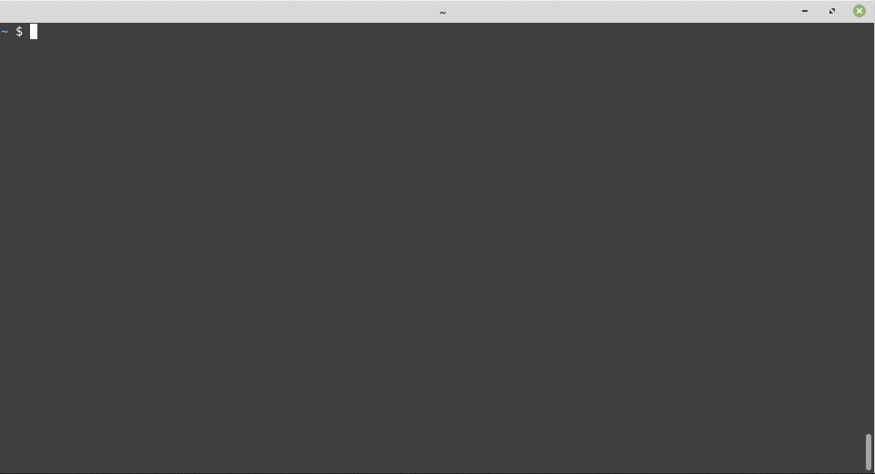
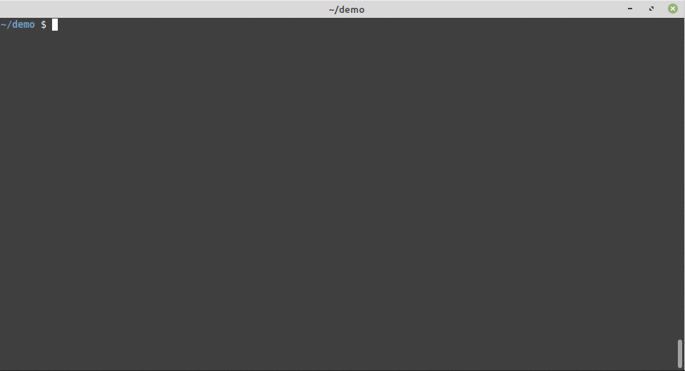

# nuxt-i18n-easy

[![npm version][npm-version-src]][npm-version-href]
[![npm downloads][npm-downloads-src]][npm-downloads-href]
[![Github Actions CI][github-actions-ci-src]][github-actions-ci-href]
[![Codecov][codecov-src]][codecov-href]
[](https://www.codacy.com/manual/sergey-demidov/nuxt-i18n-easy?utm_source=github.com&amp;utm_medium=referral&amp;utm_content=sergey-demidov/nuxt-i18n-easy&amp;utm_campaign=Badge_Grade)
[![License][license-src]][license-href]

> Automatic multilingual translator for nuxt-i18n

## Introduction

#### The I18n is great. 
But what about translating an existing project with hundreds of buttons, prompts and tips in multiple languages? 

:scream: Looks intimidating?

:angel: No need to be afraid, `nuxt-i18n-easy` will save us.





## Feautures

- Based on [nuxt-i18n](https://github.com/nuxt-community/i18n-module)'s  [lazy-load translations](https://i18n.nuxtjs.org/lazy-load-translations)
- Uses __existing__ strings as object properties
- Recursively scans the source code directories in the project
- Finds the strings that need translation
- Translates found strings using Google translate API
- Checks that the found strings and properties of the `i18n` config match
- Writes found values to i18n configuration files
- Adds syntactic sugar
- In general, makes life much easier :bath::zzz:

## Setup

#### 1. Add `nuxt-i18n-easy` module to your project
```bash
npm install nuxt-i18n-easy # or yarn add nuxt-i18n-easy
```
#### 2. Add `nuxt-i18n` & `nuxt-i18n-easy` to the `modules` section of `nuxt.config.js`
```javascript
  modules: [
    'nuxt-i18n',
    'nuxt-i18n-easy',
  ]
```
#### 3. Add `i18n` & `i18nEasy` to the `root` of `nuxt.config.js`
```javascript
export default {
  i18n: {
    locales: [
      {
        code: 'en',
        name: 'English',
        file: 'en.js'
      },
      {
        code: 'ru',
        name: 'Русский',
        file: 'ru.js'
      }
    ],
    lazy: true,
    langDir: 'lang/',
    defaultLocale: 'en'
  },
  i18nEasy: {
    directories: [                         // default directories for search
      './layouts',
      './pages',
      './components'
    ],
    files: ['*.vue', '*.js'],              // default files
    sourceLanguage: 'en',                  // default source language
    googleProjectId: 'lively-guard-123456' // See below
  },
...
```
#### 4. Create a directory `i18n.langDir` and configuration files
```bash
mkdir lang
touch lang/en.js
touch lang/ru.js
```

#### 5. Google Translation API
By default, the app uses Google translation API `V1`. 
It's free, but undocumented and has traffic restrictions. 
If you see in console something like this
```bash 
 ERROR Request failed with status code 429
```
then the restriction has already been applied. 

> Go make yourself a sandwich, after a while everything will work again

To switch to the official paid `V2` version of the API, 
you need to specify your project identifier `googleProjectId` in [i18nEasy](#3-add-i18n--i18neasy-to-the-root-of-nuxtconfigjs) section

##### [Google translate API official documentation](https://cloud.google.com/translate/docs/setup)

> If you don't understand anything there - [here](https://www.garysnotebook.com/20190409_2) is a simple guide


#### 6. [Buy me a coffee :coffee:](https://www.paypal.com/paypalme/sergeydemidov)

___

## Usage



#### 1. Strings to be translated may be designated as follows:
 classic:
```javascript
$t('Welcome')
```
 with `String.prototype` extension:
```javascript
'Inspire'.tr()
```
 or with directive `v-rt`
```vue
<p v-tr> I will be translated </p>
```
> :sparkles: Remember syntactic sugar, right? 

#### 2. Then run the `translate` script
```shell script
npx translate # or yarn run translate
```
By default script will process all `i18n.locales` defined in` nuxt.config.js`
To select a specific locale, send its code as the first parameter

```shell script
npx translate ru # or yarn run translate ru
```
#### 3. As a result, we will get ready-to-use localization files in the `i18n.langDir` directory
```bash
cat lang/ru.js

export default {
  Welcome: 'Добро пожаловать'
  Inspire: 'Вдохновлять',
  'I will be translated': 'Я буду переведен',
}
```

Something needs to be fixed here, but in general this is what we need to start

> :trollface: Give it to content managers, and go to rest

#### 4. If for some reason the `code` parameter is not suitable for specifying the target language, use `translationCode` instead
```javascript
  i18n: {
    locales: [
      {
        code: 'ua',
        name: 'Українська',
        file: 'ua.js',
        translationCode: uk
      },
```
> :u6709: A complete list of supported codes is [here](https://cloud.google.com/translate/docs/languages)

#### 5. Build you project
```bash
npm run dev # or yarn run dev
```

#### 6. Launch your favorite browser, follow the link given by NUXT + one of specified `locale.code`. For example
```
http://localhost:3000/ru
```
> :blue_book: For more details refer to [nuxt-i18n module](https://i18n.nuxtjs.org/basic-usage) documentation

#### 7. [Buy me coffee with doughnut :coffee::doughnut:](https://www.paypal.com/paypalme/sergeydemidov)

___

## Q&A

#### Q. And what we see in the original localization file?
```bash
cat lang/en.js

export default {
  Welcome: 'Welcome'
  Inspire: 'Inspire',
  'I will be translated': 'I will be translated',
}
```
> :lotus_position: Looks like some kind of Bhagavad Gita... I am that I am... Hoommm... Stop! We need to go on
##### A. It should be so. This is because we are not using slug variables.


#### Q. What about the inevitable changes in the source files?
```bash
sed -i 's/I will be translated/I will be translated again/' pages/index.vue
npx translate
cat lang/en.js

export default {
  Welcome: 'Welcome',
  Inspire: 'Inspire',
  'I will be translated': 'I will be translated', // unused
  'I will be translated again': 'I will be translated again'
}
```
##### A. As we can see, the key-value pair is in the same place, just marked as unused in the comment


#### Q. What about data loss in the event of a terrible crash?
```bash
ls lang/
en.js  en.js.2020-09-10-15-49  ru.js  ru.js.2020-09-10-15-49
```
##### A. Dont worry, everything is as it should be here too. Before changing the configuration files, a backup is made.
> :broom: Dont forget to clean there at least sometimes


#### Q. Why are you drinking so much coffee?
##### A. I drink not only coffee. Also, you can [buy me a beer :beer::beer:](https://www.paypal.com/paypalme/sergeydemidov)

___

## Development

- Setup this repository
```bash
git clone https://github.com/sergey-demidov/nuxt-i18n-easy.git
cd nuxt-i18n-easy
npm install # or yarn
```
- [Link](https://docs.npmjs.com/cli/link) it to your amazing [nuxt](https://github.com/nuxt/nuxt.js) project
```bash
npm link
cd ../amazing-nuxt-project
npm link nuxt-i18n-easy
```
:nut_and_bolt::hammer: Enjoy

___

## Known Issues

- The `v-tr` directive does __not__ support nested tags
- Google translate API v1 has a limit on the number of requests. If you see something like this
```bash 
 ERROR Request failed with status code 429
```
  just try again later
___

## If you really read up to here

There, under the hood is one more feature. You may use `String.lp()` as shortcut to `nuxt-i18n`'s [localePath()](https://i18n.nuxtjs.org/basic-usage/#nuxt-link)

For example
```vue
<nuxt-link :to="'/app/profile'.lp()">Profile</nuxt-link>
// equal to
<nuxt-link :to="localePath('/app/profile')">Profile</nuxt-link>
```

___

## License

[MIT License](./LICENSE)

Copyright (c) Sergey Demidov <sergey.k.demidov@gmail.com>

<!-- Badges -->
[npm-version-src]: https://img.shields.io/npm/v/nuxt-i18n-easy/latest.svg
[npm-version-href]: https://npmjs.com/package/nuxt-i18n-easy

[npm-downloads-src]: https://img.shields.io/npm/dt/nuxt-i18n-easy.svg
[npm-downloads-href]: https://npmjs.com/package/nuxt-i18n-easy

[github-actions-ci-src]: https://github.com/sergey-demidov/nuxt-i18n-easy/workflows/ci/badge.svg
[github-actions-ci-href]: https://github.com/sergey-demidov/nuxt-i18n-easy/actions?query=workflow%3Aci

[codecov-src]: https://img.shields.io/codecov/c/github/sergey-demidov/nuxt-i18n-easy.svg
[codecov-href]: https://codecov.io/gh/sergey-demidov/nuxt-i18n-easy

[license-src]: https://img.shields.io/github/license/sergey-demidov/nuxt-i18n-easy
[license-href]: https://npmjs.com/package/nuxt-i18n-easy
